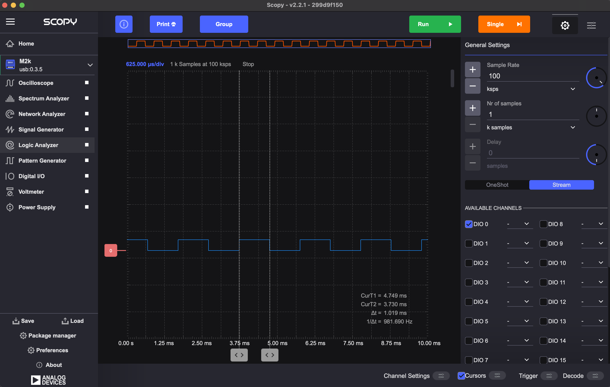
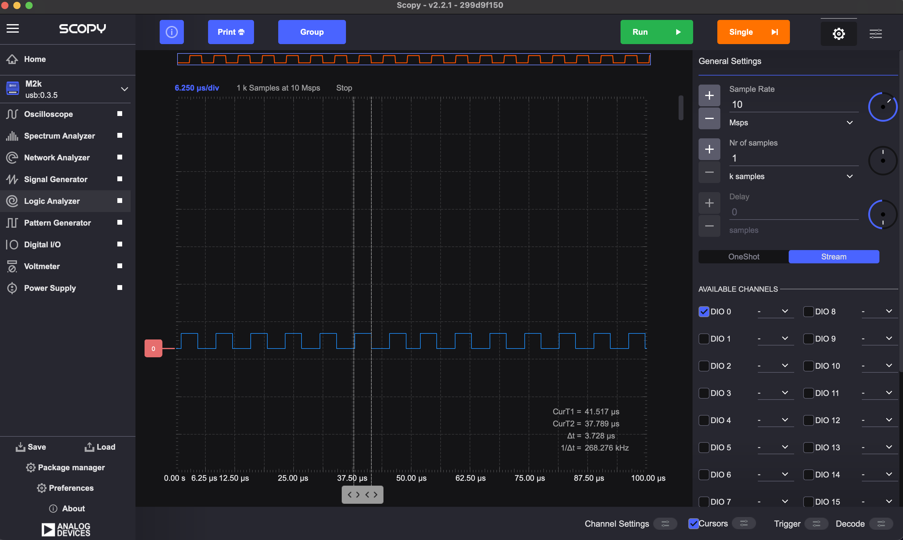
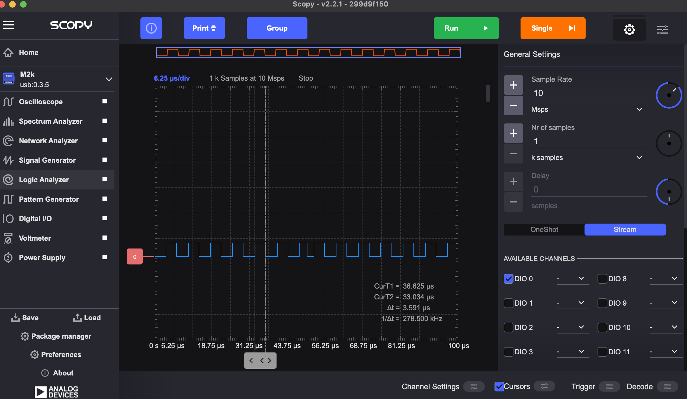

# Project 3: Measuring minimum delay in Arduino using the ADALM2000 logic analyzer

1. Understand the use of variables in code
2. Learn how to use a logic analyzer
3. Understand the concept of overhead and measure it

## resources

[Arduino Functions Reference](https://www.arduino.cc/reference/en/)

## Change Blink.ino code

You can copy the requirements to the AI agent, or code on your own.
If using the AI agent, please write below what changes were done compared to the original Blink code: Is there a difference in the code structure? What variables and function if any were added?

- Save Blink example as BlinkWithVariableDelay.ino in this folder
- Use a variable to change built in led (13) to grove led (4)
- Use a variable to change delay to 1 ms

run code:

- upload to arduino
- can you see the led blink? Why?

--> No. With delayTime = 1 the LED switches at 500 Hz (1 ms on, 1 ms off).
It is so fast that it looks permanently on for the eye.

## Use logic analyzer to see and measure the blink

- connect ADALM2000 to grove kit:
  - gnd in ADALM to GND in arduino (black color is used as a standard for GND)
  - digital pin 0 (solid pink) to pin4 in arduino (why?)

--> Because pin 4 is the signal we want to look at. DIO0 is the analyzer's first digital channel.
The shared GND is required so both devices measure voltage against the same reference.

- open scopy program
- connect to ADALM2000
- open scopy logic analyzer
- activate DIO0 and rising edge and run (why?)

--> DIO0 because that is the channel the wire is on. Rising edge so the capture
starts at the moment the pin goes LOW to HIGH, which aligns every capture to the
start of a pulse.

- play with the scopy parameters until you can see the separate blinks. Which parameter(s) do you need to change?

--> Sample rate and number of samples. For 1 ms pulses, 100 ksps with 1 k samples gives
a 10 ms window to show several complete cycles.

- use cursors and sample rate to measure the pulse width
- take screenshots and add them to the README below.

--> Measured with cursors: dt = 1.019 ms, 1/dt = 981.7 Hz. That is the 1 ms
requested delay plus a small amount of overhead. At 100 ksps one sample is 10 us,
so the resolution is +/- 10 us.

## Measure overhead

- Remove the delay statements and upload the code
- Measure pulse width. What is the minimum time that the signal is HIGH and LOW? this is the overhead.
- Take screenshots and add them to the README below.

--> With both delay() lines commented out the pulse width is 3.728 us
(1/dt = 268.3 kHz), so a full period is about 7.5 us. This is the overhead: the time
the digitalWrite() commands and one loop() cycle take by themselves. Even with zero
delay the pulse can never be shorter than this.

## even shorter blink

- delay() is limited to 1 ms. Find a function that delays 1 microsecond.
- Try different delays and measure the overhead.
- Take screenshots and add them to the README below.

--> The function is delayMicroseconds(). Requesting delayMicroseconds(1) gives a
measured pulse of 3.591 us (1/dt = 278.5 kHz), which is the same as the 3.728 us
measured with no delay at all once cursor placement error is taken into account.
So the 1 us that was asked for does not show up: it is much smaller than the
~3.7 us the loop already costs. A requested delay only changes the pulse width
once it is well above the overhead.

## Git

- Commit the new README with your screenshots
- push to your repo.

## Exercise

Paste screenshots below.

Comparison of AI changes if any:

--> Structure is unchanged: same setup() and loop(), same calls in the same
order, no new functions. Two variables were added at the top,
int ledPin = 4; and int delayTime = 1;, and the hard-coded values were replaced
by them: LED_BUILTIN became ledPin, and the literal 1000 in both delay() calls
became delayTime.

